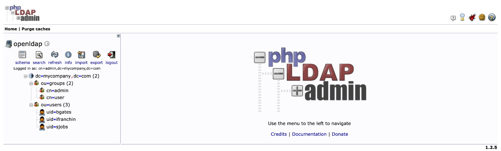
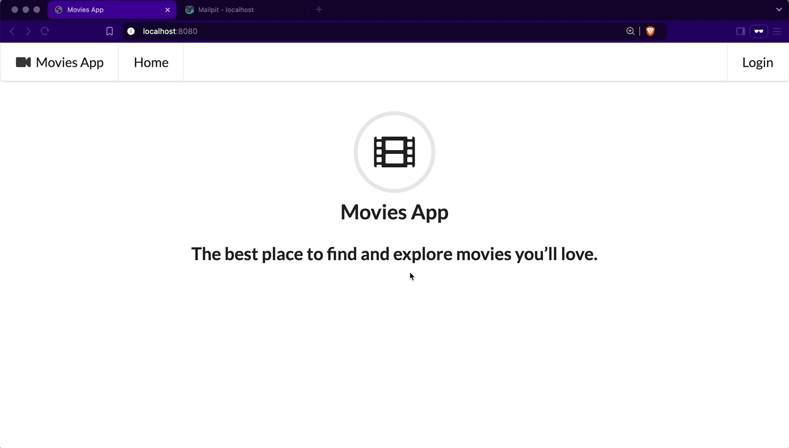

# spring-boot-ldap-auth-one-time-token-login

The goal of this project is to create a [`Spring Boot`](https://docs.spring.io/spring-boot/index.html) application called `movies-app` that allows users to log in using their LDAP pre-defined account [`LDAP Authentication`](https://docs.spring.io/spring-security/reference/servlet/authentication/passwords/ldap.html) and [`One-Time Token Login`](https://docs.spring.io/spring-security/reference/servlet/authentication/onetimetoken.html).

## Proof-of-Concepts & Articles

On [ivangfr.github.io](https://ivangfr.github.io), I have compiled my Proof-of-Concepts (PoCs) and articles. You can easily search for the technology you are interested in by using the filter. Who knows, perhaps I have already implemented a PoC or written an article about what you are looking for.

## Additional Readings

- \[**Medium**\] [**Spring Boot App with LDAP Authentication and One-Time Token Login**](https://medium.com/@ivangfr/spring-boot-app-with-ldap-authentication-and-one-time-token-login-085bb547d877)

## Applications

- ### movies-app

  A `Spring Boot` Java web application that provides a user interface for accessing movie information.

  The application is connected to an `OpenLDAP` server running in a Docker container.

  Users can log in either with their _username_ and _password_ or by requesting a one-time token sent to their _email_.

- ### MailPit

  We are using [`MailPit`](https://mailpit.axllent.org/). It's a lightweight email testing tool that captures and displays emails from your application in a web interface. It helps developers test email functionality without sending real emails.

## Prerequisites

- [`Java 21`](https://www.oracle.com/java/technologies/downloads/#java21) or higher;
- A containerization tool (e.g., [`Docker`](https://www.docker.com), [`Podman`](https://podman.io), etc.)

## Start Environment

- In a terminal, navigate to `spring-boot-ldap-auth-one-time-token-login` root folder;

- Run the following command to start Docker Compose containers:
  ```bash
  docker compose up -d
  ```

## Import OpenLDAP Users

The `LDIF` file we will use, `ldap/ldap-mycompany-com.ldif`, contains a pre-defined structure for `mycompany.com`. Basically, it has 2 groups (`admin` and `user`) and 3 users (`Ivan Franchin`, `Bill Gates` and `Steve Jobs`). Besides, it's defined that `Ivan Franchin` belongs to `admin` group, and `Bill Gates` and `Steve Jobs` belong to `user` group.
```text
Ivan Franchin > username: ifranchin, password: 123
Bill Gates > username: bgates, password: 123
Steve Jobs > username: sjobs, password: 123
```

There are two ways to import those users: by running a script or by using [`phpLDAPadmin`](https://github.com/leenooks/phpLDAPadmin).

### Import users running a script

- In a terminal, make sure you are in the `spring-boot-ldap-auth-one-time-token-login` root folder;

- Run the following script:
  ```bash
  ./import-openldap-users.sh
  ```

- Check users imported using [`ldapsearch`](https://linux.die.net/man/1/ldapsearch):
  ```bash
  ldapsearch -x -D "cn=admin,dc=mycompany,dc=com" \
    -w admin -H ldap://localhost:389 \
    -b "ou=users,dc=mycompany,dc=com" \
    -s sub "(uid=*)"
  ```

### Import users using phpLDAPadmin

- Access https://localhost:6443

- Login with the following credentials:
  ```text
  Login DN: cn=admin,dc=mycompany,dc=com
  Password: admin
  ```

- Import the file `ldap/ldap-mycompany-com.ldif`

- You should see something like
  

## Running movies-app using Maven

- In a terminal, make sure you are in `spring-boot-ldap-auth-one-time-token-login` folder;

- Run the following `Maven` command to start the application:
  ```bash
  ./mvnw clean spring-boot:run --projects movies-app
  ```

## Application URLs

| Application    | URL                    |
|----------------|------------------------|
| `movies-app`   | http://localhost:8080  |
| `MailPit`      | http://localhost:8025  |
| `phpLDAPadmin` | https://localhost:6443 |

## Demonstration

- ### LDAP Authentication

  

- ### One-Time Token Login

  

  > **Note**: If the admin or user logs out and tries to log in again using the same token, it will not work!

## Shutdown

- To stop `movies-app`, go to the terminal where it's running and press `Ctrl+C`;
- To stop and remove Docker Compose containers, network and volumes, go to a terminal and, inside `spring-boot-ldap-auth-one-time-token-login` root folder, run the command below:
  ```bash
  docker compose down -v
  ```
